<h1 align="center">💅 <a href="https://t.me/Nude_n_red_bot">Manicure Telegram Bot</a></h1>
<p align="center">
<b>Запись на ноготочки только тут. Красиво, как всегда</b>

</p><p align="center">


</p>

<p align="center">
    Русский | <a href="README.md">English</a>
</p>

> ### SMI Core
> powered by [**aiogram**](https://docs.aiogram.dev/) | Clean UX | Async swag\
> FSM-driven logic | Modular callbacks | Fully scalable  
> Type-safe handlers, sleek keyboards, zero spaghetti 🧘\
> Plug & play architecture with room for growth\
> Swagger not included — it’s built-in 😎

---

## ⚙️ Стэк

- 🐍 Python 3.11+
- 🤖 [aiogram 3.x](https://docs.aiogram.dev/) — асинхронный Telegram-фреймворк  
- 🛠️ SQLite — лёгкая база данных, с абстракциями в стиле SQLAlchemy  
- 📚 FSM — тонкая настройка управления состояниями  
- 🔗 YAML — для фраз и i18n  
- 🧪 Pytest — тесты, как положено

---

## ✨ Фичи

- ⚡ **Асинхронный и быстрый** — все взаимодействия неблокирующие
- 📍 **FSM (конечный автомат состояний)** — контекстно-зависимые сценарии пользователя
- 🔘 **Модульность коллбэков** — хендлеры разделены по ролям и доменам
- 🎛️ **Система клавиатур** — inline, reply, контекстные, структурированные
- 🧩 **Масштабируемая структура проекта** — удобно подключать модули
- 🗂️ **YAML-фразник** — простой i18n/фразинг в `phrases/`
- 🧪 **Тестируемый** — отдельная папка `tests/` с готовым Pytest

---

## 📁 Структура проекта

```
manicureBot/
│
├── bot/                       # Основная логика бота
│   ├── handlers/              # Все хендлеры и коллбэки
│   │   ├── callbacks/         # По фичам: админ, мастер, пользователь
│   │   └── ...
│   ├── keyboards/             # Клавиатуры Telegram
│   │   ├── admin/
│   │   ├── master/
│   │   └── default/
│   ├── middlewares/           # Кастомные миддлвары
│   │   ├── get_user.py
│   │   ├── shadow_ban.py
│   │   └── logging_query.py
│   ├── bot_utils/             # Вспомогательные файлы бота
│   └── ...
│
├── DB/                        # SQLite интерфейс и модели
│   ├── tables/                # По файлу на таблицу
│   ├── models.py              # Data models (DTO-подобные)
│   └── ...
│
├── config/                    # Конфигурация бота (env, константы и т.д.)
├── logs/                      # Логи (TBD)
├── phrases/                   # Фразы на YAML
├── temp/                      # Временные данные / состояния / дампы
├── tests/                     # Тесты на Pytest
├── utils/                     # Общие утилиты
├── main.py                    # Точка входа
├── .env / .env.example        # Переменные окружения
└── README.md                  # Ты здесь 😎
```
---
<h2>🗄️ ER-диаграмма БД</h2>

<p>Схема базы данных отражает основные сущности бота:</p>

<ul>
  <li><b>Users</b> — пользователи бота (клиенты, админы, мастера)</li>
  <li><b>Masters</b> — расширение профиля <code>User</code> с доп. информацией (роль мастера, спец-ка, текущая запись)</li>
  <li><b>Services</b> — услуги, доступные для записи (маникюр, дизайн, …)</li>
  <li><b>Slots</b> — временные слоты для записи (начало/конец, статус)</li>
  <li><b>Appointments</b> — записи клиентов на услуги в конкретные слоты</li>
  <li><b>Photos</b> — фото-референсы (можно прикреплять к записи)</li>
  <li><b>Appointment_Photos</b> — связь многие-ко-многим между <code>Appointments</code> и <code>Photos</code></li>
  <li><b>Weekdays</b> — справочник дней недели</li>
  <li><b>Service_Schedule</b> — доступность услуги по дням недели</li>
  <li><b>Day_Schedules</b> — рабочие часы по дням недели (JSON с интервалами)</li>
  <li><b>Channel_Messages</b> — публикации в канал с метаданными</li>
  <li><b>Queries</b> — история поисковых запросов пользователей</li>
  <li><b>Settings</b> — системная таблица для управления настройками приложения</li>
</ul>

<blockquote>
  <b>В центре — Appointments</b>, которые связывают пользователей, услуги, слоты и фото.
</blockquote>




---

## 🧪 Как запустить

### 1. 📦 Установите зависимости
```bash
pip install -r requirements.txt
```

### 2. ⚙️ Настройте .env
Скопируйте и отредактируйте переменные:
```bash
cp .env.example .env
```

### 3. 🚀 Запустите бота
```bash
python main.py
```

### 4. 🧪 Запустите тесты
```bash
pytest
```

---

## 🌀 В разработке

ManicureBot постоянно развивается. Новые FSM-сценарии, модули и улучшения UX всегда в процессе разработки.

<p align="center">
  
</p>

<p align="center">
<b>Phasalo</b><br>
<i>Делаем красиво!</i><br><br>
2025
</p>
